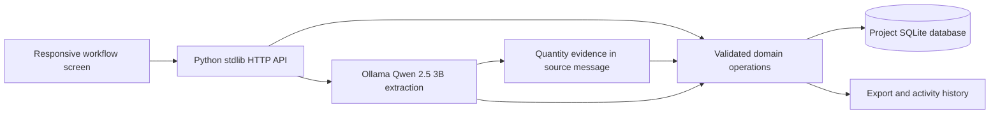

# Implemented architecture

The local prototype uses only the Python standard library, vanilla HTML/CSS/JavaScript, and project-local SQLite. This keeps setup reproducible without a package install. A production deployment can place the same domain service behind a framework and replace SQLite with PostgreSQL if multi-host writes are required.

Proposed domain operations:

- `lookup_product`
- `check_stock`
- `create_order`
- `reserve_order`
- `export_picking_list`

The local model identifies proposed product lines. A separate source-grounding step derives explicit quantities adjacent to product aliases, using digits or English one through ten; missing or ambiguous quantities remain in review. The optional OpenAI provider remains unverified. Domain code resolves exact aliases, rejects missing or invalid quantities, snapshots stored prices, and writes under `BEGIN IMMEDIATE`. Availability is recalculated inside that write transaction, preventing two local requests from reserving the same units. Every connection enables foreign keys and a busy timeout; automated coverage includes a two-request oversell race.
